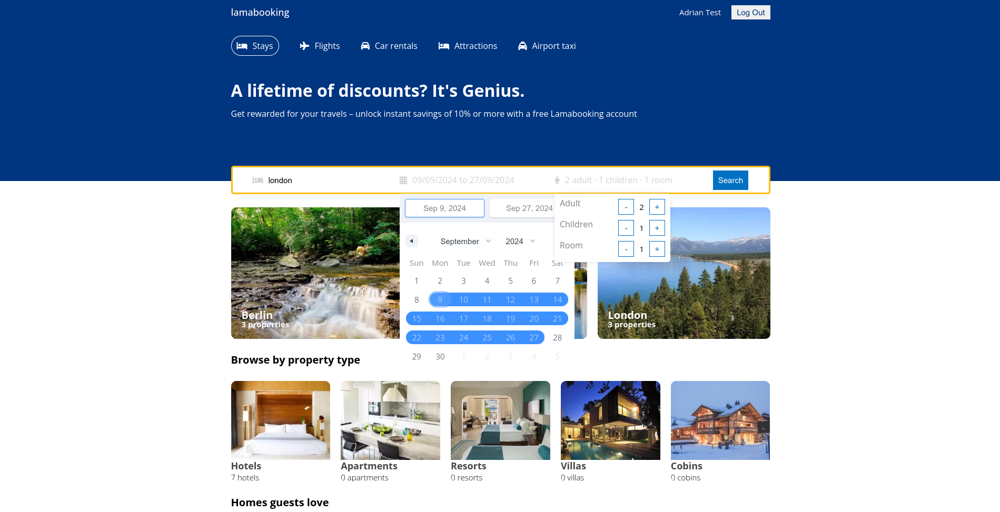
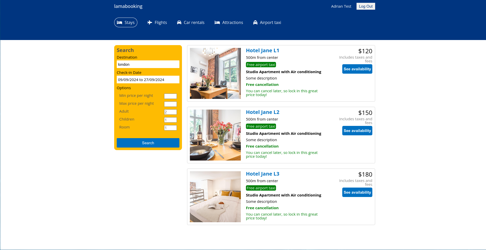
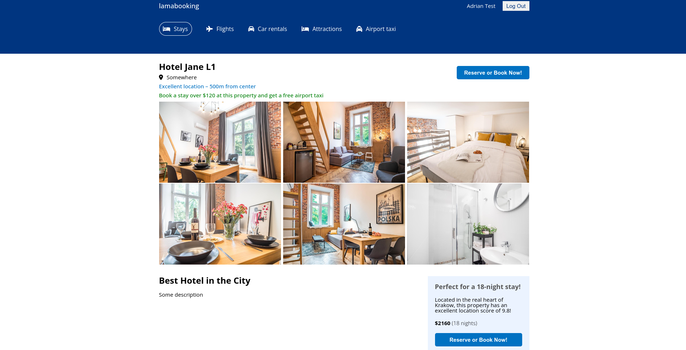
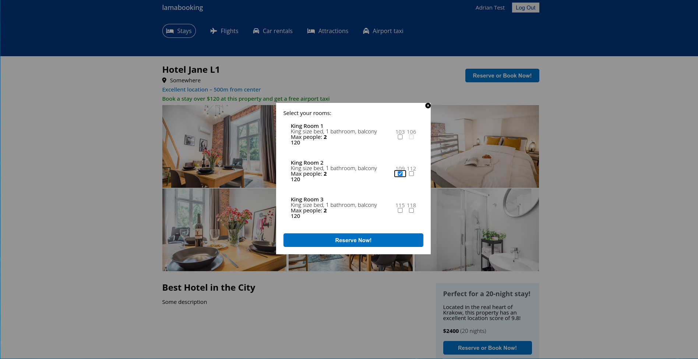

# Booking App: MERN APP

This project includes the MERN stack.

## Features included in this project

- React.js v18
- React Router DOM v6
- Context API
- Vite

## Running the app

```
# install dependencies
yarn
npm i

# run in dev mode on port 5173
yarn dev
npm run dev

```

# Description

To make a reservation in this app it's necessary to log in. Once logged in, you can check the availability of rooms in the selected date range. If they're available, you can make the reservation by adding these rooms to the DB as unavailable.

## View demo

  - You can log in with: `adrian@test.com` and password `test123`
  - Available cities: `london`, `madrid`, `berlin`

[Demo](https://booking-app-react-alxadr.netlify.app)

## Backend

[GitHub](https://github.com/AlexMartin998/booking-app-react)

### Screenshots





